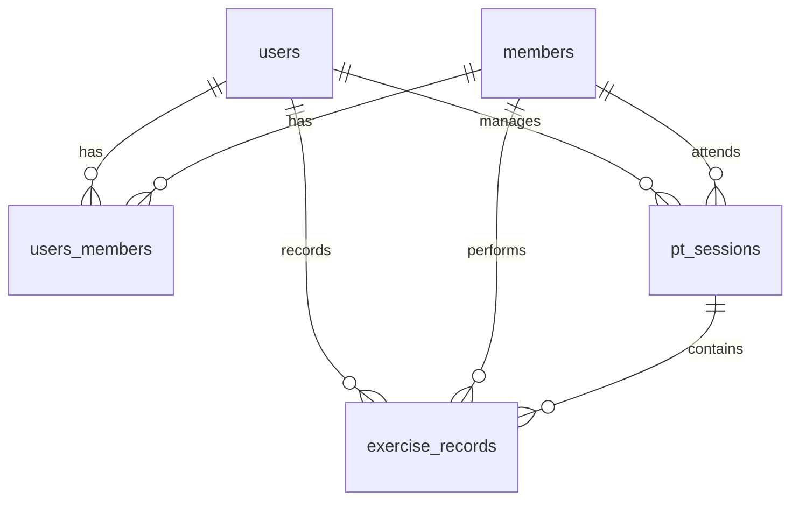

# 2024.03.19 개발 정리

## 0. 현재 데이터베이스 구조

### 0.1 테이블 구조 및 관계

#### users (트레이너 & 일반 사용자)
- **기본 정보**
  - `id`: CHAR(36), PK, UUID
  - `login_id`: VARCHAR(50), UNIQUE, NOT NULL
  - `email`: VARCHAR(100), UNIQUE
  - `name`: VARCHAR(50), NOT NULL
  - `birth_date`: DATE
  - `password`: VARCHAR(255), NOT NULL
  - `user_type`: ENUM('MEMBER', 'TRAINER'), NOT NULL
- **관계**
  - → members (M:N, users_members 테이블을 통해)
  - → pt_sessions (1:N)
  - → exercise_records (1:N)

#### members (회원)
- **기본 정보**
  - `id`: CHAR(36), PK, UUID
  - `sequence_number`: INT, UNIQUE, NOT NULL
  - `login_id`: VARCHAR(50), UNIQUE, NOT NULL
  - `password`: VARCHAR(255), NOT NULL
  - `name`: VARCHAR(255), NOT NULL
  - `gender`: ENUM('MALE', 'FEMALE'), NOT NULL
  - `contact`: VARCHAR(20), NOT NULL
  - `total_pt_count`: INT, DEFAULT 0
  - `remaining_pt_count`: INT, DEFAULT 0
  - `notes`: TEXT
  - `is_active`: BOOLEAN, DEFAULT TRUE
  - `created_at`: DATETIME
- **관계**
  - → users (M:N, users_members 테이블을 통해)
  - → pt_sessions (1:N)
  - → exercise_records (1:N)

#### users_members (트레이너-회원 관계)
- **기본 정보**
  - `id`: CHAR(36), PK, UUID
  - `trainer_id`: CHAR(36), FK(users.id), NOT NULL
  - `member_id`: CHAR(36), FK(members.id), NOT NULL
  - `created_at`: DATETIME
- **제약조건**
  - UNIQUE(trainer_id, member_id)

#### pt_sessions (PT 세션)
- **기본 정보**
  - `id`: CHAR(36), PK, UUID
  - `member_id`: CHAR(36), FK(members.id), NOT NULL
  - `trainer_id`: CHAR(36), FK(users.id), NULL
  - `session_number`: INT, NOT NULL
  - `session_date`: DATE, NOT NULL
  - `start_time`: TIME, NOT NULL
  - `end_time`: TIME, NOT NULL
  - `is_completed`: BOOLEAN, DEFAULT FALSE
  - `notes`: TEXT
  - `created_at`: DATETIME
  - `updated_at`: DATETIME
- **관계**
  - → exercise_records (1:N)

#### exercise_records (운동 기록)
- **기본 정보**
  - `id`: CHAR(36), PK, UUID
  - `session_id`: CHAR(36), FK(pt_sessions.id), NOT NULL
  - `exercise_name`: VARCHAR(100), NOT NULL
  - `duration`: INT, NOT NULL
  - `repetitions`: INT, NOT NULL
  - `sets`: INT, NOT NULL, DEFAULT 1
  - `body_part`: TEXT, NOT NULL
  - `input_source`: ENUM('MEMBER', 'TRAINER'), NOT NULL
  - `member_id`: CHAR(36), FK(members.id), NOT NULL
  - `trainer_id`: CHAR(36), FK(users.id), NULL
  - `notes`: TEXT
  - `created_at`: DATETIME
  - `updated_at`: DATETIME

### 0.2 주요 인덱스
- `members.login_id`: 회원 로그인 ID 검색
- `users.login_id`: 사용자 로그인 ID 검색
- `pt_sessions.session_date`: 세션 날짜 기반 검색
- `exercise_records.session_id`: 세션별 운동 기록 검색

### 0.3 데이터베이스 관계도


## 1. API 명세서 정리

### PT 세션 운동 기록 관련 API

#### 1.1 PT 세션 운동 기록 조회
- **기능**: 특정 PT 세션의 운동 기록을 조회
- **Method**: GET
- **Endpoint**: `/api/v1/pt-sessions/{session_id}/exercises`
- **응답 예시**:
```json
{
    "session_info": {
        "id": "uuid",
        "session_number": 1,
        "session_date": "2024-03-19",
        "start_time": "09:00",
        "end_time": "10:00",
        "is_completed": false
    },
    "exercises": [
        {
            "id": "uuid",
            "exercise_name": "벤치프레스",
            "duration": 300,
            "sets": 3,
            "repetitions": 12,
            "body_part": "가슴"
        }
    ]
}
```

#### 1.2 PT 세션 운동 기록 수정
- **기능**: PT 세션의 운동 기록을 수정
- **Method**: PUT
- **Endpoint**: `/api/v1/pt-sessions/{session_id}`
- **요청 데이터**:
```json
{
    "session_date": "2024-03-19",
    "start_time": "09:00",
    "end_time": "10:00",
    "exercises": [
        {
            "exercise_name": "벤치프레스",
            "duration": 300,
            "sets": 3,
            "repetitions": 12,
            "body_part": "가슴"
        }
    ]
}
```

## 2. 새로 사용한 기술 스택 개념 정리

### 2.1 Alembic 마이그레이션
- **정의**: SQLAlchemy와 함께 사용되는 데이터베이스 마이그레이션 도구
- **주요 기능**: 
  - 데이터베이스 스키마 변경 관리
  - 변경 이력 추적
  - 롤백 지원
- **공식 문서**: [Alembic Documentation](https://alembic.sqlalchemy.org/en/latest/)

## 3. 문제 해결 과정 정리

### 3.1 운동 기록에 세트 수 추가
#### 문제 상황
- 운동 기록에 세트 수 정보가 없어 정확한 운동 기록 관리가 어려움

#### 해결 과정
1. 데이터베이스 스키마 수정
   - exercise_records 테이블에 sets 컬럼 추가
   - 기본값 1로 설정
   - NOT NULL 제약조건 추가

2. 모델 및 API 수정
   - ExerciseRecord 모델에 sets 필드 추가
   - PT 세션 API에서 세트 수 처리 로직 구현

3. 프론트엔드 수정
   - 운동 기록 입력 폼에 세트 수 입력 필드 추가
   - 세션 조회/수정 시 세트 수 표시 및 수정 기능 구현

### 3.2 시간 입력 유효성 검사 개선
#### 문제 상황
- 운동 시간 입력 시 잘못된 형식으로 입력되는 문제 발생

#### 해결 방법
- formatDuration 함수 구현으로 실시간 입력 포맷팅
- validateDuration 함수로 최종 유효성 검사
- 분:초 형식으로 자동 변환 및 제한 (59:59 초과 불가)

## 4. 터미널 명령어 정리

### 4.1 Alembic 마이그레이션 명령어
```bash
# 마이그레이션 파일 생성
alembic revision --autogenerate -m "add sets to exercise records"

# 마이그레이션 적용
alembic upgrade head

# 마이그레이션 상태 확인
alembic current
```

#### 마이그레이션 파일 예시
```python
"""add sets to exercise records

Revision ID: add_sets_to_exercise_records     # 마이그레이션 고유 식별자
Revises: add_updated_at_to_pt_sessions       # 이전 마이그레이션 ID (의존성)
Create Date: 2024-03-19 17:00:00.000000      # 마이그레이션 생성 일시

이 마이그레이션은 exercise_records 테이블에 운동 세트 수를 기록하기 위한 컬럼을 추가합니다.
"""
from typing import Sequence, Union
from alembic import op                        # 데이터베이스 작업을 위한 Operations API
import sqlalchemy as sa                       # SQLAlchemy 스키마 정의

# 마이그레이션 식별자 설정
revision: str = 'add_sets_to_exercise_records'            # 현재 리비전 ID
down_revision: Union[str, None] = 'add_updated_at_to_pt_sessions'  # 이전 리비전 ID
branch_labels: Union[str, Sequence[str], None] = None    # 브랜치 레이블 (필요한 경우)
depends_on: Union[str, Sequence[str], None] = None       # 추가 의존성 (필요한 경우)

def upgrade() -> None:
    """
    마이그레이션 업그레이드 함수
    데이터베이스를 새 버전으로 업그레이드하는 과정을 정의
    """
    # 1. sets 컬럼 추가
    # nullable=True로 설정하여 기존 레코드에 영향을 주지 않고 컬럼 추가
    op.add_column('exercise_records',
        sa.Column('sets', sa.Integer(), nullable=True, default=1)
    )
    
    # 2. 기존 레코드의 sets를 1로 설정
    # 기존 데이터 마이그레이션: NULL 값을 가진 레코드를 기본값 1로 업데이트
    op.execute("""
        UPDATE exercise_records 
        SET sets = 1 
        WHERE sets IS NULL
    """)
    
    # 3. NOT NULL 제약조건 추가
    # 모든 레코드가 값을 가지게 된 후, NOT NULL 제약조건 적용
    op.alter_column('exercise_records', 'sets',
        existing_type=sa.Integer(),
        nullable=False
    )

def downgrade() -> None:
    """
    마이그레이션 다운그레이드 함수
    변경사항을 이전 버전으로 되돌리는 과정을 정의
    """
    # sets 컬럼 삭제
    # 컬럼 제거만으로 충분함 (관련된 모든 데이터와 제약조건이 함께 제거됨)
    op.drop_column('exercise_records', 'sets')
```

### 4.2 Git 명령어
```bash
# 변경사항 스테이징
git add .

# 커밋
git commit -m "feat: PT 세션 운동 기록에 세트 수 추가 및 UI/UX 개선"

# 브랜치에 푸시
git push origin feature/member-management-fix
```

## 5. 다음 개발 계획
1. 운동 기록 통계 기능 구현
2. 회원별 운동 기록 분석 기능 추가
3. 운동 기록 엑셀 출력 기능 구현